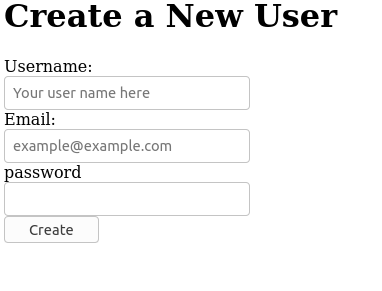
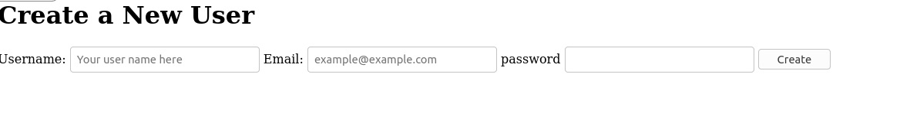
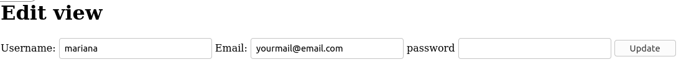

# README

In this project, is to build a form the old fashioned way and then the Rails way.

## Built With

* Ruby 2.7.2
* Ruby on Rails 6.1.1

## Setup

- To run it in your local machine you need to follow these steps.

 - Clone repository repository with this command on terminal
  git clone git@github.com:atenaiis/Ree-former.git

## Run
 - Once you are in your local directory, open your console and run:

 - bundle install

 - rails db:migrate

 - rails server

## You can use the general commands to create objects or get them.

To set up the server.

After this you can open your favorite web-browser and copy paste the next:

http://localhost:3000/users/new

Play with the form and create a new user, then copy and paste the next:

http://localhost:3000/users/1/edit

## Authors

👤 **Author1**

- Github: [@atenaiis](https://github.com/atenaiis)
- Twitter: [@spranomarian](https://twitter.com/SopranoMarian)
- Linkedin: [linkedin](https://www.linkedin.com/in/mariana-atenai-campos-garcia-a30791143/)

## 🤝 Contributing

Contributions, issues and feature requests are welcome!

## Show your support

Give a ⭐️ if you like this project!

## Acknowledgments

- Hat tip to anyone whose code was used
- Inspiration
- etc